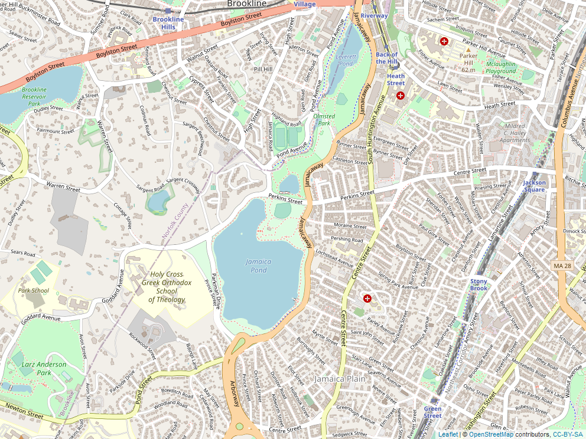
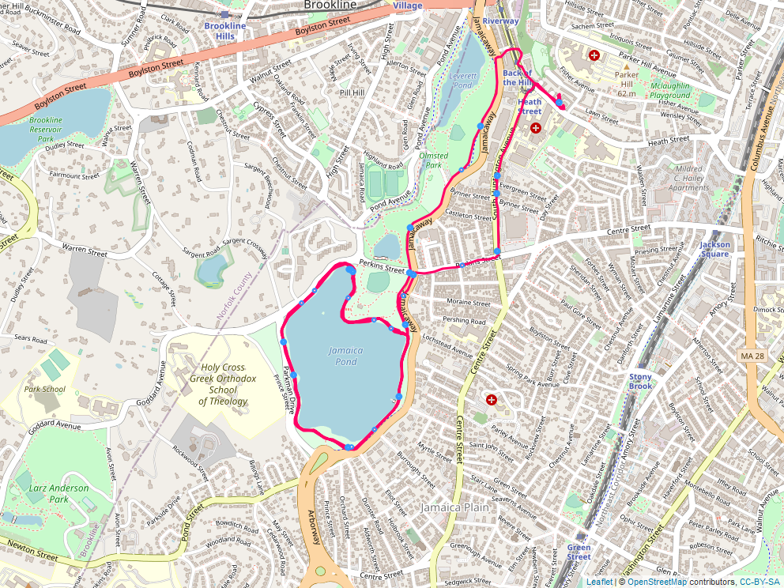

```{r knitr_setup, include=FALSE}
knitr::opts_chunk$set(echo = TRUE)
```

## Setup

```{r "install-load-pacakges"}

# Load packages, installing as needed
if (!requireNamespace("pacman", quietly = TRUE)) install.packages("pacman")
pacman::p_load(devtools, webshot, tidyverse, readr, here, XML, tibble, plotKML, 
               dplyr, lubridate, scales, knitr, ggplot2, geosphere, 
               leaflet,maps, mapview, sf)
pacman::p_load_gh("brianhigh/stopr")
pacman::p_load_gh("stadiamaps/ggmap")

# webshot::install_phantomjs() # one time install

# Run a separate script to register the API key to use with Stadia Maps
# See: https://docs.stadiamaps.com/guides/migrating-from-stamen-map-tiles/
# register_stadiamaps("YOUR-API-KEY-HERE")
# source(here("reg_api.R"))
```


```{r}
# Define variables
gpx_file <- here::here("data/Morning_Run_2022-01-01.gpx")

# Set stop threshold in secs
st = 45
```


This project tries to identify stops made during a morning run. To this end, the GPS data and a few analyses have been taken from 
<a href="https://martakarass.github.io/post/2022-01-05-gps_strava_read_and_viz/" > Marta Karas's Github </a>. The stops are identified using *find_stops* function from the <a href="https://github.com/brianhigh/stopr" > **stopr** </a> package developed by Brian High. 


## Import GPX file and save as CSV

```{r gpx-to-csv}

# Import GPX file
df <- as_tibble(readGPX(gpx_file)$tracks[[1]][[1]]) %>%
  select(-ele) %>%
  rename(longitude = lon,
         latitude = lat,
         datetime = time) %>%
  mutate(datetime = as_datetime(datetime))


# Save as CSV
write.csv(df, here("data/morning_run.csv"))
```


```{r check-data}

head(as.data.frame(df))
```


## Get map of Boston

```{r map-boston}

# Map Boston

mar = 0.5

boston_map <- leaflet() %>%
  addTiles() %>%
  fitBounds(
    min(df$longitude) - mar,
    min(df$latitude) + mar,
    max(df$longitude) - mar,
    max(df$latitude) + mar
  ) %>%
  setView(mean(df$longitude), mean(df$latitude), zoom = 15)


# Save map in png format to include in rendered document
mapview::mapshot(boston_map, file = here("/images/boston_map.png"))
```





## Compute distance, time elapsed and speed

```{r "compute"}

# Compute distance (in meters) between subsequent GPS points
df <- 
  df %>%
  mutate(lat_lead = lead(latitude)) %>%
  mutate(lon_lead = lead(longitude)) %>%
  rowwise() %>%
  mutate(dist_to_lead_m = distm(c(longitude, latitude), c(lon_lead, lat_lead), 
                                fun = distHaversine)[1,1]) %>%
  ungroup()

# compute time elapsed (in seconds) between subsequent GPS points
df <- 
  df %>%
  mutate(datetime_lead = lead(datetime)) %>%
  mutate(ts_diff_sec = as.numeric(difftime(datetime_lead, datetime, units = "secs"))) 

# compute metres per seconds, kilometres per hour 
df<- 
  df%>%
  mutate(speed_m_per_sec = dist_to_lead_m / ts_diff_sec) %>%
  mutate(speed_km_per_hr = speed_m_per_sec * 3.6)

# remove columns that aren't needed anymore
df <- 
  df %>% 
  select(-c(lat_lead, lon_lead, datetime_lead, ts_diff_sec))

# examine the first six rows of data
head(df) %>% as.data.frame()

```


```{r "plot-run-path"}

# Plot run path

plot(x = df$longitude, y = df$latitude, 
     type = "l", col = "blue", lwd = 3, 
     xlab = "Longitude", ylab = "Latitude")

```


```{r "find-stops"}
# Find stops that meet stop threshold set above

stops <- find_stops(df, stop_min_duration_s = st, digits = 3, k = 3,
                       .vars = c(time = 'datetime', lat = 'latitude', 
                                 lon = 'longitude'))

plot(stops$longitude, stops$latitude, 
     pch = 19, col = "dark orange",
     main = "Stops",
     xlab = "Longitude", ylab = "Lattitude", cex.axis = 0.90)
```


```{r "overlay-points-and-line"}

plot(x = df$longitude, y = df$latitude, 
     type = "l", col = "darkturquoise", lwd = 2, 
     xlab = "Longitude", ylab = "Latitude")

points(stops$longitude, stops$latitude, 
     pch = 19, col = "dark orange", lwd = 0.5)

```


```{r "create-run-map"}

# Trace morning run with stops

run_map <- leaflet() %>%
  addTiles() %>%
  fitBounds(min(df$longitude) - mar,
            min(df$latitude) + mar,
            max(df$longitude) - mar,
            max(df$latitude) + mar) %>%
  setView(mean(df$longitude), mean(df$latitude), zoom = 15) %>%
  addPolylines(df$longitude,df$latitude,color = "#FF0066", 
               weight = 3, opacity = 1) %>%
  addCircles(stops$longitude, stops$latitude, radius = stops$duration/10,
    color = "#3399FF",opacity = 1, 
    fill = TRUE, fillColor = "#FFFFFF", fillOpacity = 1)


# Save map in png format to include in rendered document
mapview::mapshot(run_map, file = here("/images/run_map.png"))

#knitr::include_graphics("./images/run_map.png")
```




