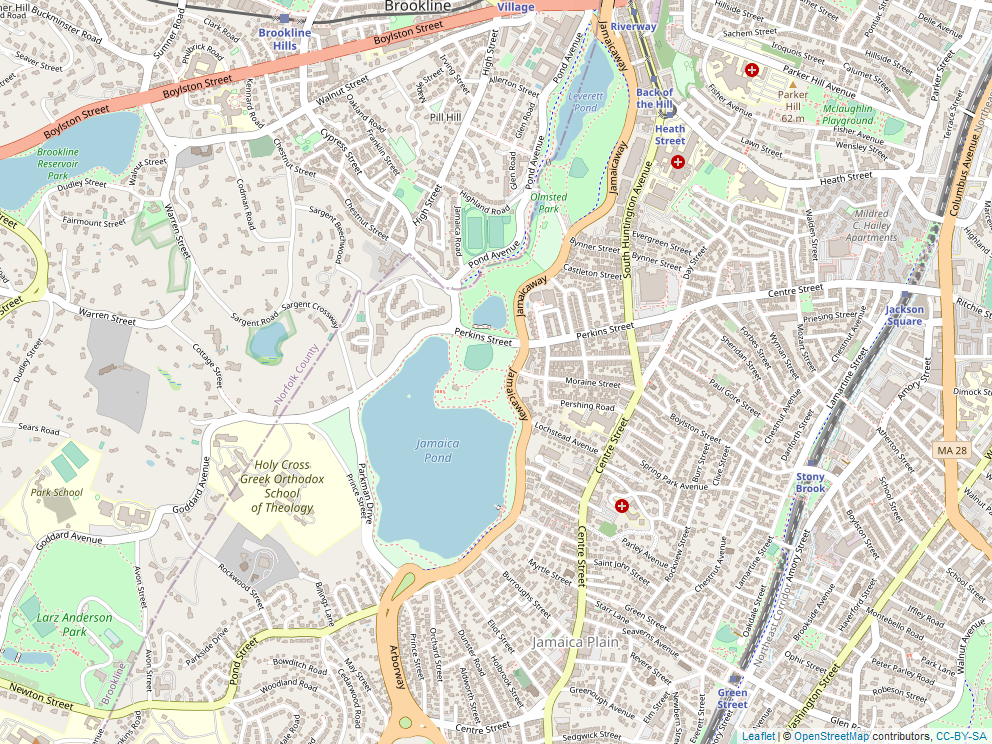

Exploring GPS Data
================
Surakshya Dhakal
2023-10-10

## Setup

``` r
# Load packages, installing as needed
if (!requireNamespace("pacman", quietly = TRUE)) install.packages("pacman")
pacman::p_load(devtools, webshot, tidyverse, readr, here, XML, tibble, plotKML, 
               dplyr, lubridate, scales, knitr, ggplot2, geosphere, 
               leaflet,maps, mapview, sf)
pacman::p_load_gh("brianhigh/stopr")
pacman::p_load_gh("stadiamaps/ggmap")

# webshot::install_phantomjs() # one time install

# Run a separate script to register the API key to use with Stadia Maps
# See: https://docs.stadiamaps.com/guides/migrating-from-stamen-map-tiles/
# register_stadiamaps("YOUR-API-KEY-HERE")
# source(here("reg_api.R"))
```

``` r
# Define variables
gpx_file <- here::here("data/Morning_Run_2022-01-01.gpx")

# Set stop threshold in secs
st = 45
```

This project tries to identify stops made during a morning run. To this
end, the GPS data and a few analyses have been taken from
<a href="https://martakarass.github.io/post/2022-01-05-gps_strava_read_and_viz/" >
Marta Karas’s Github </a>. The stops are identified using *find_stops*
function from the <a href="https://github.com/brianhigh/stopr" >
**stopr** </a> package developed by Brian High.

## Import GPX file and save as CSV

``` r
# Import GPX file
df <- as_tibble(readGPX(gpx_file)$tracks[[1]][[1]]) %>%
  select(-ele) %>%
  rename(longitude = lon,
         latitude = lat,
         datetime = time) %>%
  mutate(datetime = as_datetime(datetime))


# Save as CSV
write.csv(df, here("data/morning_run.csv"))
```

``` r
head(as.data.frame(df))
```

    ##   longitude latitude            datetime
    ## 1 -71.10868 42.32791 2022-01-01 14:42:01
    ## 2 -71.10868 42.32791 2022-01-01 14:42:06
    ## 3 -71.10866 42.32795 2022-01-01 14:42:08
    ## 4 -71.10872 42.32817 2022-01-01 14:42:10
    ## 5 -71.10875 42.32816 2022-01-01 14:42:11
    ## 6 -71.10875 42.32814 2022-01-01 14:42:12

## Get map of Boston

``` r
# Map Boston

mar = 0.5

boston_map <- leaflet() %>%
  addTiles() %>%
  fitBounds(
    min(df$longitude) - mar,
    min(df$latitude) + mar,
    max(df$longitude) - mar,
    max(df$latitude) + mar
  ) %>%
  setView(mean(df$longitude), mean(df$latitude), zoom = 15)


# Save map in png format to include in rendered document
mapview::mapshot(boston_map, file = here("/images/boston_map.png"))
```

<figure>

<figcaption aria-hidden="true">Boston</figcaption>
</figure>

## Compute distance, time elapsed and speed

``` r
# Compute distance (in meters) between subsequent GPS points
df <- 
  df %>%
  mutate(lat_lead = lead(latitude)) %>%
  mutate(lon_lead = lead(longitude)) %>%
  rowwise() %>%
  mutate(dist_to_lead_m = distm(c(longitude, latitude), c(lon_lead, lat_lead), 
                                fun = distHaversine)[1,1]) %>%
  ungroup()

# compute time elapsed (in seconds) between subsequent GPS points
df <- 
  df %>%
  mutate(datetime_lead = lead(datetime)) %>%
  mutate(ts_diff_sec = as.numeric(difftime(datetime_lead, datetime, units = "secs"))) 

# compute metres per seconds, kilometres per hour 
df<- 
  df%>%
  mutate(speed_m_per_sec = dist_to_lead_m / ts_diff_sec) %>%
  mutate(speed_km_per_hr = speed_m_per_sec * 3.6)

# remove columns that aren't needed anymore
df <- 
  df %>% 
  select(-c(lat_lead, lon_lead, datetime_lead, ts_diff_sec))

# examine the first six rows of data
head(df) %>% as.data.frame()
```

    ##   longitude latitude            datetime dist_to_lead_m speed_m_per_sec
    ## 1 -71.10868 42.32791 2022-01-01 14:42:01       0.000000        0.000000
    ## 2 -71.10868 42.32791 2022-01-01 14:42:06       4.406590        2.203295
    ## 3 -71.10866 42.32795 2022-01-01 14:42:08      25.403927       12.701963
    ## 4 -71.10872 42.32817 2022-01-01 14:42:10       2.510645        2.510645
    ## 5 -71.10875 42.32816 2022-01-01 14:42:11       2.264098        2.264098
    ## 6 -71.10875 42.32814 2022-01-01 14:42:12       1.899407        1.899407
    ##   speed_km_per_hr
    ## 1        0.000000
    ## 2        7.931862
    ## 3       45.727068
    ## 4        9.038324
    ## 5        8.150751
    ## 6        6.837864

``` r
# Plot run path

plot(x = df$longitude, y = df$latitude, 
     type = "l", col = "blue", lwd = 3, 
     xlab = "Longitude", ylab = "Latitude")
```

<!-- -->

``` r
# Find stops that meet stop threshold set above

stops <- find_stops(df, stop_min_duration_s = st, digits = 3, k = 3,
                       .vars = c(time = 'datetime', lat = 'latitude', 
                                 lon = 'longitude'))

plot(stops$longitude, stops$latitude, 
     pch = 19, col = "dark orange",
     main = "Stops",
     xlab = "Longitude", ylab = "Lattitude", cex.axis = 0.90)
```

<!-- -->

``` r
plot(x = df$longitude, y = df$latitude, 
     type = "l", col = "darkturquoise", lwd = 2, 
     xlab = "Longitude", ylab = "Latitude")

points(stops$longitude, stops$latitude, 
     pch = 19, col = "dark orange", lwd = 0.5)
```

<!-- -->

``` r
# Trace morning run with stops

run_map <- leaflet() %>%
  addTiles() %>%
  fitBounds(min(df$longitude) - mar,
            min(df$latitude) + mar,
            max(df$longitude) - mar,
            max(df$latitude) + mar) %>%
  setView(mean(df$longitude), mean(df$latitude), zoom = 15) %>%
  addPolylines(df$longitude,df$latitude,color = "#FF0066", 
               weight = 3, opacity = 1) %>%
  addCircles(stops$longitude, stops$latitude, radius = stops$duration/10,
    color = "#3399FF",opacity = 1, 
    fill = TRUE, fillColor = "#FFFFFF", fillOpacity = 1)


# Save map in png format to include in rendered document
mapview::mapshot(run_map, file = here("/images/run_map.png"))

#knitr::include_graphics("./images/run_map.png")
```

<figure>

<figcaption aria-hidden="true">Morning run with stops &gt; 45 sec scaled
to show variation in duration</figcaption>
</figure>
